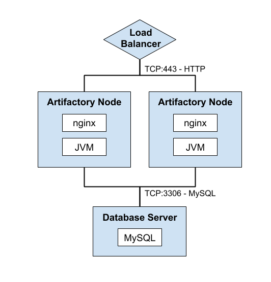

# Support Contacts

|        | Team           | Contact Info          | Runbook Review        |
|--------|----------------|-----------------------|-----------------------|
|Level 1 | IT Support     | support@commpany.com  | Billy Bob - 6/5/2018  |
|Level 2 | RE Operations  | reops@company.com     | Jane Doe - 4/9/2018   |
|Level 3 | Joe Smith      | (999) 999-999         | Joe Smith - 7/12/2018 |

For additional support details see:
* Support Roles and Responsibilities
* DBA On-Call group for database support
* IT On-Call group for host or OS support

# Overview

This is an example of an Operations Runbook for the Artifactory application.
Artifactory is a commercial product for managing repositories of content,
such as software packages, and pushing that content out to large numbers of
consumers.  Artifactory is managed using a REST API or a web interface.
It is most commonly used for managing Maven (Java) repositories, but also
supports many different content types such as RPMs, Docker images, Python
packages, and others.

For additional application information see:
* Repository and permission target naming conventions
* User and group naming conventions
* Licensing and support information

External Resources
* [JFrog Artifactory](https://jfrog.com/artifactory/)

# Architecture
The architectural diagram shows the hosts and services which compose the application.  
It should provide enough information to be useful for audiences such as system
administrators, network administrators, or anyone who might need to troubleshoot
an alert or outage.



# Hosts

| Env    | Role           | Hostname               | DNS Alias                 |
|--------|----------------|------------------------|---------------------------|
| Prod   | Active Node    | artprod01.company.com  | artifactory.company.com   |
|        | Active Node    | artprod02.company.com  |                           |
|        | Database       | adbprod01.company.com  | artifactorydb.company.com |
| Test   | Active Node    | arttest01.company.com  | arttest.company.com       |
|        | Active Node    | arttest02.company.com  |                           |
|        | Database       | adbtest01.company.com  | artdbtest.company.com     |

# Network

| Service      | Port        | Protocol       |
|--------------|-------------|----------------|
| artifactory  | 8080        | TCP - http     |
| mysql        | 3306        | TCP - mysql    |
| nginx        | 443         | TCP - https    |

# Filesystem

| Service      | Configuration    | Logs                 | Data                 |
|--------------|------------------|----------------------|----------------------|
| artifactory  | /etc/artifactory | /var/log/artifactory | /var/lib/artifactory |
| mysql        | /etc/mysql       | /var/log/mysql       | /var/lib/mysql       |
| nginx        | /etc/nginx       | /var/log/nginx       | n/a                  |


# Monitoring

| Host         | Item        | Severity | Resolution                     |
|--------------|-------------|----------|--------------------------------|
| Application  | artifactory |   SEV1   | Check logs, restart service    |
|              | nginx       |   SEV1   | Check logs, restart service    |
|              | disk_root   |   SEV2   | Clear out old logs             |
|              | disk_app    |   SEV2   | Perform artifact cleanup in UI |
| Database     | mysql       |   SEV1   | Check logs, restart service    |
|              | disk_root   |   SEV2   | Clear out old logs             |
|              | disk_db     |   SEV2   | Perform artifact cleanup in UI |

# Metrics

Performance metrics are collected using the `collectd` process on each host.
Data is logged to a TimescaleDB database and visualized with a Grafana dashboard.
Links are provided below to allow the user to navigate to the appropriate Grafana dashboards which show the status of this Artifactory instance:

* Artifactory Application Performance  (Grafana dashboard)
* Artifact and Repository count  (Grafana dashboard)

# Log Aggregation

System and application logs are collected from each server using the `filebeat`
process on each host.  Messages are shipped to Logstash, parsed, and ingested into
Elasticsearch for indexing.  Links are provided below to allow the user to navigate
to the appropriate Kibana dashboard to query and visualize the log data:

* Artifactory application logs
* Artifactory HTTP request dashboard

# Access Control

Artifactory has been configured to use the corporate LDAP server.  Users should
authenticate through the Artifactory UI using their domain credentials.  Any user
in the `Developers` group should have full read-only access to all binary repositories.
Service accounts have been created locally in Artifactory to provide team-specific
credentials for CI (Jenkins) builds to publish artifacts.  Contact information for the service accounts can be found in the account details page in the Artifactory UI.

The following naming conventions are used to define team repositories: `group-type`

<dl>
  <dt>`group`</dt>
  <dd>Development group name, typically a short 3 to 5 letter acronym</dd>

  <dt>`type`</dt>
  <dd>Repoository type (`maven`, `rpm`, `python`)</dd>
</dl>


# Backup and Recovery

The servers are configured and updated using Ansible playbooks.  Updates can be
applied by cloning the git repository from source control and running the following
command:

```
ansible-playbook -i hosts.prod site.yml
```

The Artifactory binary artifacts are stored on a separate network storage device managed by corporate IT.  This storage is mounted as an NFS filesystem.  Backup,
snapshots, and recovery are all managed by IT and they will need to be contacted
to perform any data recovery.

The MySQL database is backed up using a nightly cron job which runs as the `mysql`
user on the database server.  The backup script will retain the last 7 days worth
of database dumps.

# Maintenance and Cleanup

If the application data volume or the database data volume become full, the first
action should be to contact IT to request additional storage.  This will prevent
the application from failing and give the teams time to evaluate current artifact
usage and delete any artifacts which will never be shipped or depended on by other
builds.

# Application Tuning

The following JVM parameters have been set in the Artifactory config file as
recommended by JFrog support:

```
-server -Xms2g -Xmx8g -Xss256k -XX:+UseG1GC
```
